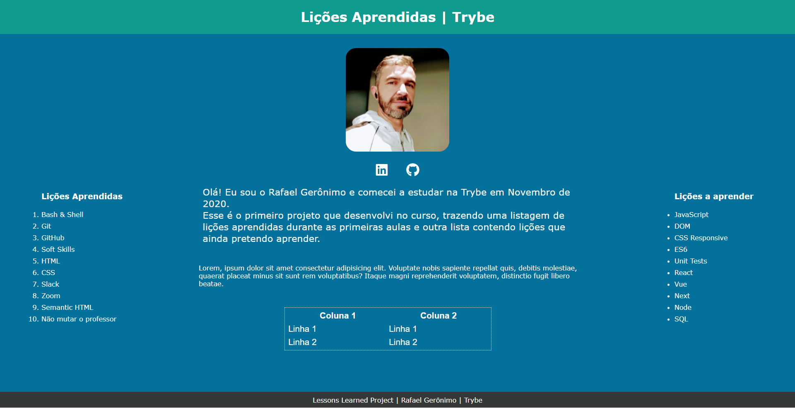

 

## 📗 Sobre

Primeiro projeto desenvolvido pela Trybe, onde colocamos em prática alguns conceitos aprendidos nas aulas iniciais com HTML e CSS.

**Módulo**: Fundamentos do Desenvolvimento Web

**Bloco**: Introdução à HTML e CSS

## 🚀 Demo
http://rafaelgeronimo.me/trybe-project-lessons-learned/

## 🖼 Screenshot

## 🛠 Instalação

Não é necessário instalar esse projeto. Basta executar o arquivo `index.html`

## 💻 Tecnologias
Esse projeto foi construído com:
- HTML
- CSS

## 📝Requisitos do projeto
| Abaixo, a descrição na íntegra de todos os requisitos do projeto:

Deve ser criado um site com uma série de informações a respeito do que foi aprendido nos últimos três blocos, estilizado de forma apropriada.

**Em outras palavras, uma página de `Lessons Learned`**;
### Requisitos Obrigatórios:

  

    1 - O corpo da página deve possuir uma cor de fundo específica
  

  <ul>
    <li>
      Possuir cor de fundo: rgb(253, 251, 251)
    </li>
  </ul>

  

    2 - Seu site deve possuir uma barra superior com um título
  

  <ul>
    <li>
      A barra deve possuir o ID "cabecalho"
    </li>
    <li>
      O elemento com o id <kbd>cabecalho</kbd> deve ser fixo no topo da página, com a propriedade top tendo <kbd>0px</kbd>
    </li>
    <li>
      O título deve estar dentro da barra e possuir o ID "titulo", além de ser uma tag <kbd>h1</kbd>
    </li>
  </ul>

  

    3 - A página deve possuir uma foto sua
  

  <ul>
    <li>
      A foto deve ser inserida utilizando uma tag <kbd>img</kbd> com o ID "minha_foto"
    </li>
  </ul>

  

    4 - A página deve possuir uma lista de lições aprendidas
  

  <ul>
    <li>
      A lista deve ser numerada e possuir o ID "licoes_aprendidas"
    </li>
    <li>
      A lista deve possuir 10 itens
    </li>
  </ul>

  

    5 - A página deve possuir uma lista de lições que ainda deseja aprender
  

  <ul>
    <li>
      A lista <strong>não</strong> deve ser numerada e deve possuir o ID "licoes_a_aprender"
    </li>
    <li>
      A lista deve possuir 10 itens
    </li>
  </ul>

  

    6 - A página deve possuir um rodapé
  

  <ul>
    <li>
      O rodapé deve utilizar a tag <kbd>footer</kbd> e possuir o ID "rodape"
    </li>
  </ul>

  

    7 - A página deve possuir pelo menos um link externo
  

  <ul>
    <li>
      A configuração desse link deve ser feita para abrir em uma nova aba do navegador
    </li>
  </ul>

  

    8 - Crie um artigo sobre seu aprendizado
  

  <ul>
    <li>
      A <kbd>tag</kbd> <kbd>article</kbd> devem ser utilizadas
    </li>
    <li>
      O artigo deve ter mais de 300 letras e menos de 600
    </li>
  </ul>

  

    9 - Crie uma seção que conta uma passagem sobre seu aprendizado
  

  <ul>
    <li>
      A <kbd>tag</kbd> <kbd>aside</kbd> deve ser utilizada
    </li>
    <li>
      A seção deve ter mais que 100 letras e menos que 300
    </li>
  </ul>

  

    10 - Torne o seu site mais acessível e melhore seu ranqueamento em mecanismos de busca na Web aplicando os elementos HTML de acordo com o sentido e propósito de cada um deles
  

  <ul>
    <li>
      A página deve possuir um elemento <kbd>article</kbd>
    </li>
    <li>
      A página deve possuir um elemento <kbd>header</kbd>
    </li>
    <li>
      A página deve possuir um elemento <kbd>nav</kbd>
    </li>
    <li>
      A página deve possuir um elemento <kbd>section</kbd>
    </li>
    <li>
      A página deve possuir um elemento <kbd>aside</kbd>
    </li>
    <li>
      A página deve possuir um elemento <kbd>footer</kbd>
    </li>
  </ul>

  

    11 - Seu site deve passar sem problemas na verificação de semântica do site achecker
  

  <ul>
    <li>
      Verificar sua página no [achecker](https://achecker.ca/checker/index.php)
    </li>
  </ul>

### Requisitos Bônus:

  

    12 - Adicione uma tabela à página
  

  <ul>
    <li>
      A página deve possuir uma tabela
    </li>
  </ul>

  

    13 - Brinque com o Box model!
  

  <ul>
    <li>
      Altere <kbd>margin</kbd>, <kbd>padding</kbd> e <kbd>border</kbd> dos elementos para ver, na prática, como esses atributos influenciam e melhoram a visualização dos componentes
    </li>
  </ul>

  

    14 - Altere atributos relacionados as fontes
  

  <ul>
    <li>
      Altere o tamanho da letra
    </li>
    <li>
      Altere a cor da letra
    </li>
    <li>
      Altere o espaçamento entre as linhas
    </li>
    <li>
      Altere o <kbd>font-family</kbd>
    </li>
  </ul>

  

    15 - Faça com que seu artigo e seção sobre aprendizados fiquem um ao lado do outro
  

  <ul>
    <li>
      Utilizar a classe 'lado-esquerdo'
    </li>
    <li>
      Utilizar a classe 'lado-direito'
    </li>
    <li>
      Verificar se os elementos com as classes lado-direito e lado-esquerdo estão posicionados corretamente
    </li>
  </ul>

